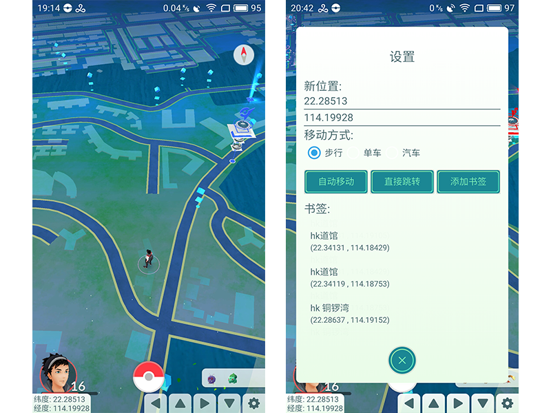
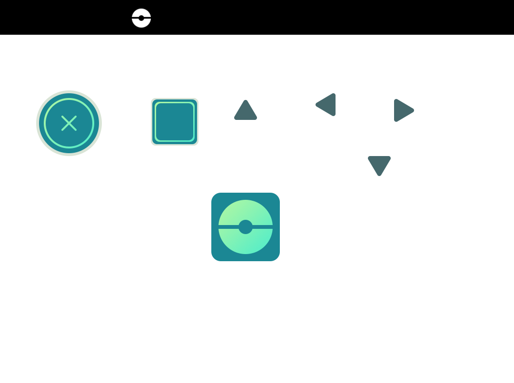

#FakeGPS-PokemonGo

> 基于 FakeGPS ，对 PokemonGo 优化。

* 沉浸体验: UI风格和PokemonGo保持一致.
* 移动模式: 步行,单车,汽车
* 自动移动模式: 将自动移动到新位置, ****孵蛋利器****

#PSD

软件用到的图标PhotoShop源文件

#安装说明

由于模拟位置需要借助系统的`INSTALL_LOCATION_PROVIDER`权限，因此需要安装到system分区中。

- 1、Root手机，获取system分区的读写权限。
- 2、借助[Lucky Patcher](https://lucky-patcher.netbew.com/) 把FakeGPS以系统应用的方式安装。
- 3、打开Android系统设置开发者选项，取消“允许模拟位置”勾选。设置位置服务仅使用GPS设备。
- 4、打开FakeGPS，点击Start，这个时候手柄会展示出来，如果没有弹出，请打开应用的悬浮窗显示权限（特别是MIUI和Flyme，权限默认是关闭的），然后打开地图应用（谷歌地图和高德地图测试可用）。查看是否能够定位到设置的坐标，点击手柄上的按键检查是否能够正常移动。

# License
[The MIT License (MIT)](http://opensource.org/licenses/MIT)
